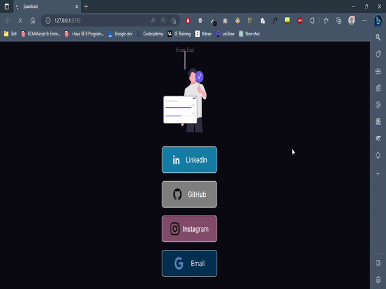

# <h1 align="center">  </h1>

## [InstagramNav](https://joaoitoxd.vercel.app/)

**Versão 2.0 da aplicação do site pessoal de links, [Em desenvolvimento...]!**

- **O projeto é um site de links para minhas redes sociais.**
## React com TypeScript...

**Construída de base com a melhor das tecologias do mercado, que é o React, em sua sintaxe em TypeScript! Para também estudo e desenvolvimento da superset e das ferramentas...**

## Tecnologias usadas:

- [vanilla-extract](https://raw.githubusercontent.com/JoaoIto/joaoitoxd/22997d66364e9a913c1798a349efe6d22e2f8137/src/assets/correctWebsite.svg): Framework CSS-in-JS para construção de estilização muito mais simples!

- [vite.js](https://vitejs.dev/): Para o build do projeto em React.JS

- [typed.js](https://github.com/mattboldt/typed.js/): Biblioteca JS para criação do efeito de digitação!

---

## Captura gif

---

